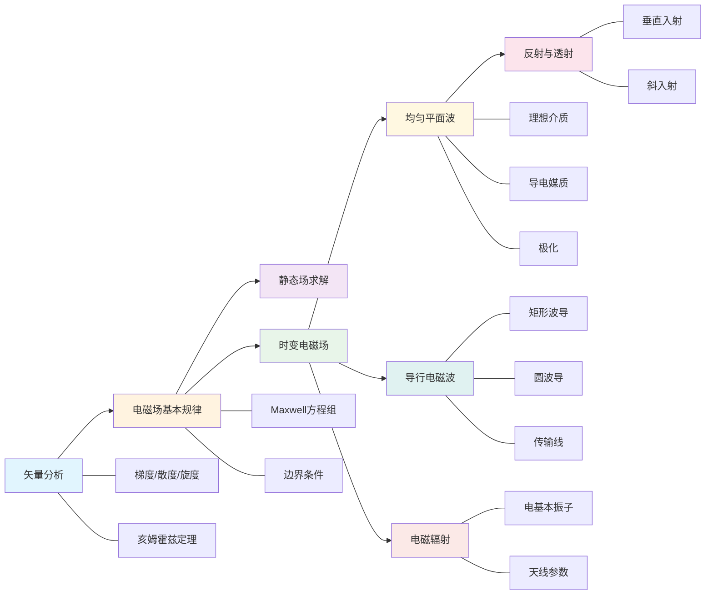

# 电磁场与电磁波

> **课程**：电磁场与电磁波 2026春
> **班级**：24电子科学与技术(青年1班), 24微电子科学与工程
> **教材**：电磁场与电磁波

---

## 知识脉络

## 核心公式速览

| 定律/定理 | 公式 |
|-----------|------|
| Maxwell方程组 | $\nabla \times \mathbf{H} = \mathbf{J} + \frac{\partial \mathbf{D}}{\partial t}$ |
| 高斯定理 | $\nabla \cdot \mathbf{D} = \rho$ |
| 法拉第定律 | $\nabla \times \mathbf{E} = -\frac{\partial \mathbf{B}}{\partial t}$ |
| 磁通连续性 | $\nabla \cdot \mathbf{B} = 0$ |
| 波动方程 | $\nabla^2 \mathbf{E} - \mu\varepsilon\frac{\partial^2\mathbf{E}}{\partial t^2} = 0$ |
| 真空中波速 | $c = 1/\sqrt{\mu_0\varepsilon_0} \approx 3\times 10^8 \ \mathrm{m/s}$ |
| 真空中波阻抗 | $\eta_0 = \sqrt{\mu_0/\varepsilon_0} \approx 377\ \Omega$ |
| 坡印廷矢量 | $\mathbf{S} = \mathbf{E} \times \mathbf{H}$ |
| 趋肤深度 | $\delta = \sqrt{2/(\omega\mu\sigma)}$ |
| 反射系数 | $\Gamma = (\eta_2 - \eta_1)/(\eta_2 + \eta_1)$ |

## 章节导航

| 章节 | 课件数 | 核心内容 |
|------|--------|----------|
| [第一章 绪论与矢量分析](01-绪论与矢量分析/index.md) | 3 | - 直角坐标系、柱坐标系、球坐标系的定义与转换 |
| [第二章 电磁场基本规律](02-电磁场基本规律/index.md) | 4 | - 电流连续性方程：$\nabla \cdot \mathbf{J} + \frac{\partial \rho}{\partial t} = 0$ |
| [第三章 静态电磁场及其解法](03-静态电磁场及其解法/index.md) | 1 | - 电位 $\Phi$ 满足泊松方程：$\nabla^2 \Phi = -\frac{\rho}{\varepsilon}$ |
| [第四章 时变电磁场](04-时变电磁场/index.md) | 4 | - 无源区的波动方程： |
| [第五章 均匀平面波](05-均匀平面波/index.md) | 3 | - 波动方程的解：$\mathbf{E} = \mathbf{E}_0 e^{-j k z}$ |
| [第六章 均匀平面波的反射与透射](06-均匀平面波的反射与透射/index.md) | 3 | - 反射系数：$\Gamma = \frac{\eta_2 - \eta_1}{\eta_2 + \eta_1}$ |
| [第七章 导行电磁波](07-导行电磁波/index.md) | 5 | - TEM波、TE波、TM波的概念 |
| [第八章 电磁辐射](08-电磁辐射/index.md) | 1 | - 滞后位表达式：$\Phi(\mathbf{r}, t) = \frac{1}{4\pi\varepsilon}\int_V \frac{\rho(\mathbf{r}', t-R/c)}{R} dV'$ |
| [课程案例仿真与实践](09-课程案例仿真/index.md) | 1 | - 典型电磁问题的仿真案例 |

## 常用常数

| 常数 | 符号 | 数值 |
|------|------|------|
| 真空介电常数 | $\\varepsilon_0$ | $8.854 \\times 10^{-12}$ F/m |
| 真空磁导率 | $\\mu_0$ | $4\\pi \\times 10^{-7}$ H/m |
| 真空中光速 | $c$ | $2.998 \\times 10^8$ m/s |
| 真空中波阻抗 | $\\eta_0$ | $376.73\\ \\Omega$ |
| 电子电荷 | $e$ | $1.602 \\times 10^{-19}$ C |

---

## 站点统计

- 页面数： 10
- 公式数： 50+
- 课件数： 25
- 图片数： 800+
